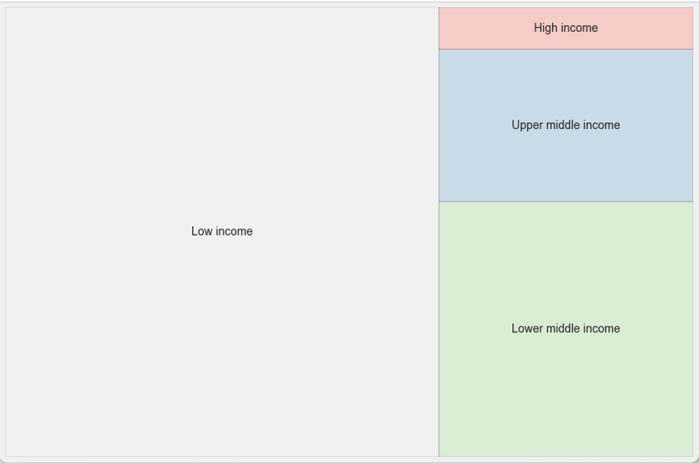

# **Proyecto entregable del módulo de Análisis y Exploración de Datos del Bootcamp Data Science en The Bridge**

### Antonio Pulido - abril 2021

### Temática elegida: Accidentes Aéreos

### Objetivos:

```
-	Recibir un dataset sucio y limpiar los campos que se van a utilizar.
-	Transformar el dataset y crear uno nuevo, incorporando información de otras fuentes de datos
-	Analizar los datos y formular hipótesis
-	Crear dataframes y visualizaciones para la validación de las hipótesis
-	Creae un “Story Telling” y plasmarlo en una presentación de negocio
-	Defender la presentación en público.

```

## Fuentes de información:

* **[Kaggle (mihirsethi007):](https://www.kaggle.com/mihirsethi007/aircrash-data)**

    * aircrash1908-2008.csv:
        > Accidentes aéreos entre 1908 y 2009

* **[bancomundial.org](https://data.worldbank.org/indicator/IS.AIR.DPRT?view=chart)**

    *	API_IS.AIR.DPRT_DS2_en_csv_v2_2169474.csv:
        > Transporte aéreo, **salidas de vuelos/país/año** a nivel mundial

    *	API_IS.AIR.PSGR_DS2_en_csv_v2_2252261.csv:
        > Transporte aéreo, **pasajeros transportados/país/año** a nivel mundial

    *	API_SP.POP.TOTL_DS2_en_csv_v2_2252106.csv:
        > Población global, **evolución/país/año** de población mundial

* **[planecrashinfo.com](http://www.planecrashinfo.com)**
* **[airfleets.net](https://www.airfleets.net/crash/crash_search.htm)**
* **[Estadística para todos](http://www.estadisticaparatodos.es/taller/loterias/loterias.html)**

## Código:

### Jupyter Notebooks:

* **Aircraft_Investigation.ipynb*:**
      
      > Código utilizado en la extracción y limpieza de datos

* **Aircraft_Visualization.ipynb*:**
     
      > Código utilizado para la creación de visualizaciones para la presentación

### Instalaciones:

``` python
#Ejecutar en una celda:
!pip install squarify
```
### Librerías utilizadas:

``` python
import pandas as pd
import numpy as np
import matplotlib as mlb
import matplotlib.pyplot as plt
import seaborn as sns
import squarify
from sklearn import preprocessing
import urllib.request
from bs4 import BeautifulSoup
from datetime import timedelta,date,datetime
import time
import random

import warnings
warnings.filterwarnings("ignore")
plt.style.use('seaborn-bright')
```
### Proyecto:

#### Gracias a la integración del **dataset de accidentes aéreos** con la información de **bancomundial.org**, de vuelos, pasajeros y población, por año y país, ha sido posible comprobar la cantidad de accidentescon respecto a la cantidad de vuelos, pudiendo hacer rankings interesantes con estos datos:

*Top 20 Países por número de accidentes*


*Top 20 Países por número de vuelos*


#### Se puede comprobar que los países donde más accidentes hay es porque también es donde más vuelos hay, sin embargo, haciendo la relación, la foto muestra que la peor proporción está en países afrianos y asiáticos sobre todo, estando los países ricos (donde más se vuela) en las últimas posiciones del ranking. Como ejemplo, Estados Unidos, que es el que más accidentes tiene, aparece en el puesto 119 de 145 en la relaciónde accidentes respecto a vuelos:

*Top 20 Países por ratio accidentes/vuelos*


#### Se observa una relación directa entre el nivel de ingresos de los países y la mejor relación accidentes/vuelos:

*Ratio accdentes/vuelos de grupos de países por nivel de ingresos*


---

#### Otro análisis interesante es ver la línea de evolución de accidentes junto con la evolución de población mundial, cantidad de vuelos y cantidad de pasajeros, estandarizando los datos para que se puedan ver juntos:

*Comparativa evolución accidentes, población mundial, número de vuelos y número de pasajeros anualmente*


---

Estos y muchos otros datos curiosos están dentro de los notebooks.
